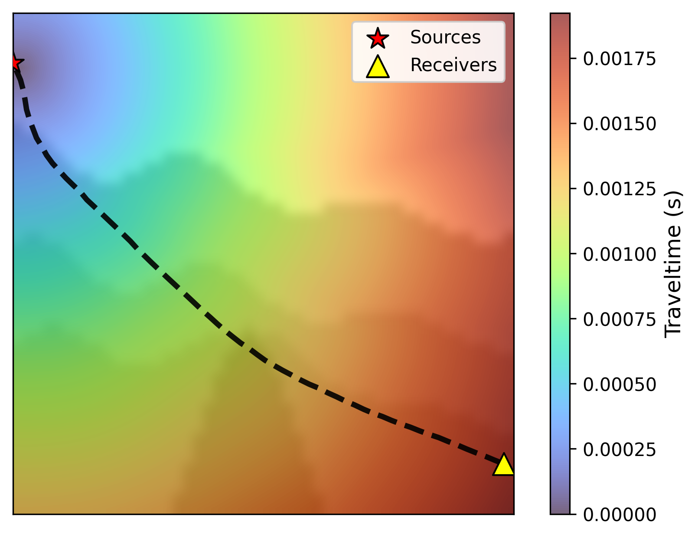
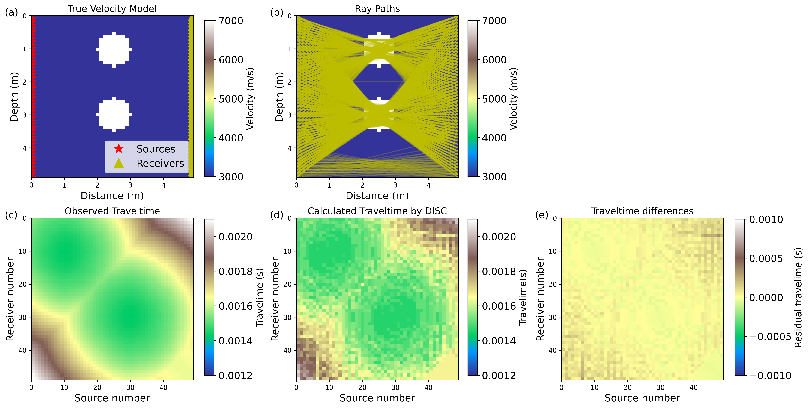
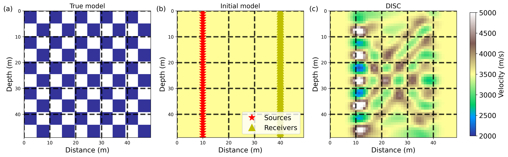
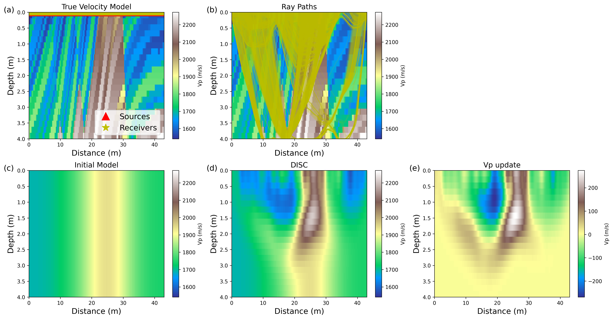
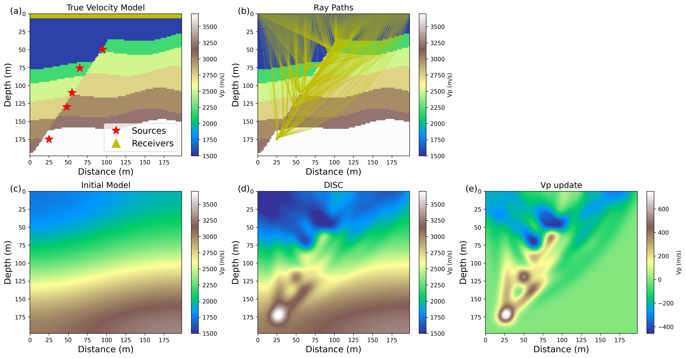
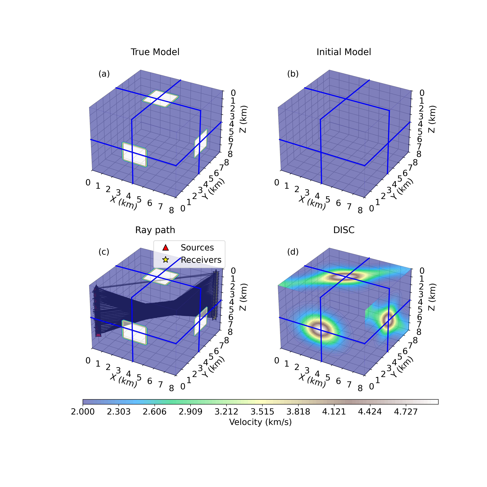
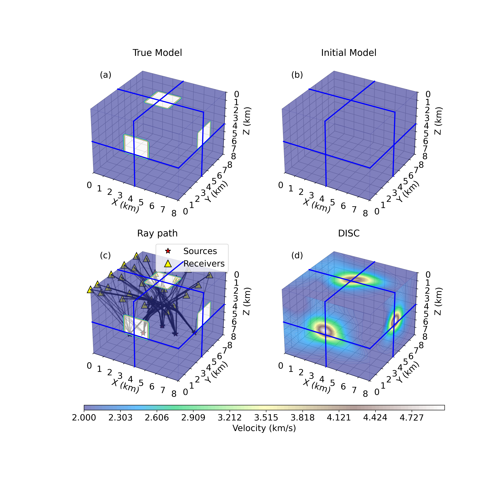
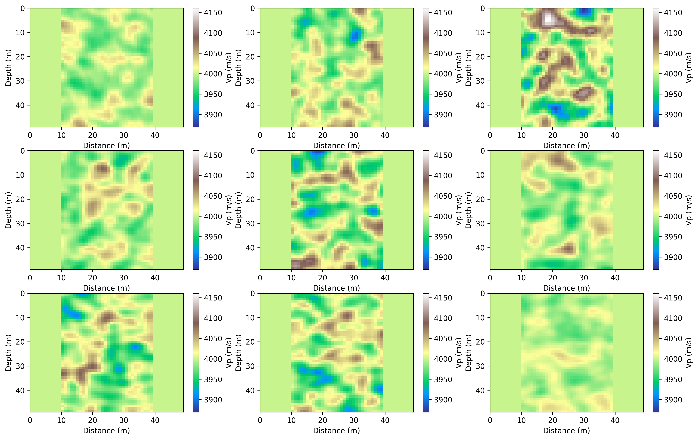
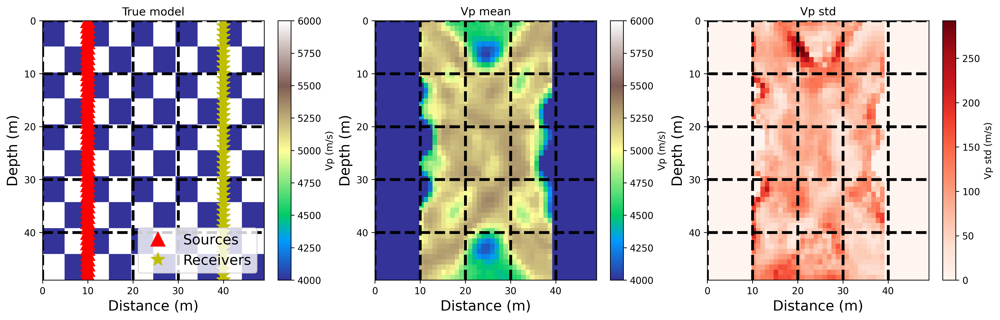

# <div align="center">
# DISCtomo: A Python package for direct smoothness constrained seismic traveltime tomography and uncertainty analysis
**Chao Li**<sup>1</sup> &nbsp;&nbsp;
**Yangkang Chen**<sup>1</sup>

<sup>1</sup> Bureau of Economic Geology, John A. and Katherine G. Jackson School of Geosciences, The University of Texas at Austin  


</div>

---

## Abstract
We develop a open-source Python library DISCtomo, a flexible, compact, and user-friendly package for tomography based velocity building and uncertainty evaluation. Different from classic ray-tracing- or Eikonal equation-based tomography, DISCtomo directly constructs the tomography ray-path matrix from a precomputed traveltime table. In addition, shaping regularization is employed to control model smoothness, while the conjugate gradient (CG) algorithm is used to further refine the inversion results. Specifically, DISCtomo includes ray path matrix (RPM) construction functions for both 2D and 3D scenarios, Stein variational gradient descent (SVGD) for tomography uncertainty evaluation, and provides implementations of 2D and 3D models. Users can reproduce our examples or solve their own problems by just defining the geometry and initial model. Numerical experiments shown in the manuscript validate that DISCtomo is a effective and scalable package, which can be used for tomography at different scales in practice. 

---
## Copyright
    The DISCtomo developing team, 2026-present
    
---
## License
    MIT License  

## Framework

<p align="center">
  
</p>


<p align="center">
  <b>Example 1.</b>
A schematic illustration of DISC-based ray tracing from a receiver location to the source position.
The figure can be reproduced using the
<a href="https://github.com/ChaoDeepGeo/DISCtomo/blob/main/notebook/main_raytracing.ipynb">
ray-tracing notebook
</a>.
</p>

The workflow of DISC consists of the following main steps:

1. Conduct ray tracing based on a traveltime table estimated by Eikonal equation.
2. Construct ray path matrix based on he initial model
3. Compute the misfit between synthetic data and observed data.
4. Estimate the model update using CG iteration with shaping regularization and update the current model
5. Repeat steps 1-4 until convergence.

---

## Documents demonstration

- The data folder contains necessary models and dataset used to reproduce the numerical results.
- The Notebook folder contains necessary code to reproduce the tomography experiments with different geometries (e.g., crosswell and surface) for both active and passive source examples, including checkerboard, saltbody, 3D anormal and SVGD DISC for uncertain evaluation.
- The disc folder constains all the necessary functions for DISC package.
- DISC depends on the following external packages: 1. [Pyekfmm](https://github.com/aaspip/pyekfmm) 2. [Pyseistr](https://github.com/aaspip/pyseistr)

---
## Result

<p align="center">
  
</p>

<p align="center">
  <b>Example 2.</b> (a) Real velocity model, (b) Ray tracing using DISC method, (c) Observed traveltime calculated using Eikonal equation, (d) Estimated traveltime by DISC method, and (e) The traveltime difference bewteen Figures 2(c) and 2(d). The figure can be reproduced using the
<a href="https://github.com/ChaoDeepGeo/DISCtomo/blob/main/notebook/main_traveltime_comp.ipynb">
traveltime_comparison notebook
</a>.
</p>

<p align="center">
  
</p>

<p align="center">
  <b>Example 3.</b> Crosswell geometry. (a) Real checkerboard velocity model, (b) Initial constant velocity model, and (c) Inverted velocity model using DISC method. The figure can be reproduced using the
<a href="https://github.com/ChaoDeepGeo/DISCtomo/blob/main/notebook/main_checkboarder.ipynb">
checkboarder notebook
</a>.
</p>

<p align="center">
  
</p>

<p align="center">
  <b>Example 4.</b> Comparison of active source traveltime tomography results. (a) True Marmousi velocity model. (b) Ray paths traced from the surface acquisition geometry. (c) Initial velocity model. (d) Reconstructed velocity model obtained using the DISC method. (e) Velocity model update after DISC inversion. The figure can be reproduced using the
<a href="https://github.com/ChaoDeepGeo/DISCtomo/blob/main/notebook/main_surface_active.ipynb">
surface_active notebook
  </a>.
</p>


<p align="center">
  
</p>

<p align="center">
  <b>Example 5.</b> Comparison of passive source traveltime tomography results. (a) True velocity model. (b) Ray paths traced from the surface acquisition geometry. (c) Initial velocity model. (d) Reconstructed velocity model obtained using the DISC method. (e) Velocity model update after DISC inversion. The figure can be reproduced using the
<a href="https://github.com/ChaoDeepGeo/DISCtomo/blob/main/notebook/main_surface_passive.ipynb">
surface_passive notebook
  </a>.
</p>

<p align="center">
  
</p>

<p align="center">
  <b>Example 6.</b> Inversion result comparison of 3D model for activate sources. (a) Real 3D model. (b) Initial 3D model. (c) Inverted 3D model via DISC method. The figure can be reproduced using the
<a href="https://github.com/ChaoDeepGeo/DISCtomo/blob/main/notebook/main_3Dmodel.ipynb">
crosswell_3D notebook
  </a>.
</p>

<p align="center">
  
</p>

<p align="center">
  <b>Figure 6.</b> Inversion result comparison of 3D model for passive sources. (a) Real 3D model. (b) Initial 3D model. (c) Inverted 3D model via DISC method.  The figure can be reproduced using the
<a href="https://github.com/ChaoDeepGeo/DISCtomo/blob/main/notebook/main_3Dmodel_passive.ipynb">
surface_3D notebook
</p>

<p align="center">
  
</p>

<p align="center">
  <b>Figure 7.</b> Generated initial particles used for ASVGD DISC inverison. The geometry is same as that shown in Figure 3.
</p>


<p align="center">
  
</p>

<p align="center">
  <b>Figure 8.</b> (a) Real checkerboard model, (b) Estimated Vp mean value distribution using ASVGD DISC, and (c) Estimated Vp std map (uncertainty distribution). Higher std value means more uncertainties.
</p>


---


## Installation

To set up the environment, run:

```bash
conda env create -f environment.yml
conda activate your_env_name
```

---

## Reference 

> Li and Chen, 2026, DISCtomo: A Python package for direct smoothness constrained seismic traveltime tomography and uncertainty analysis, Seismica, TBD, TBD, TBD.

### BibTex

```bibtex

@ARTICLE{DISC2026,
  author={Li, Chao and Chen, Yangkang},
  journal={Seismica}, 
  title={DISCtomo: A Python package for direct smoothness constrained seismic traveltime tomography and uncertainty analysis}, 
  year={2026},
  volume={TBD},
  number={},
  pages={TBD},
  doi={TBD}
}


```


