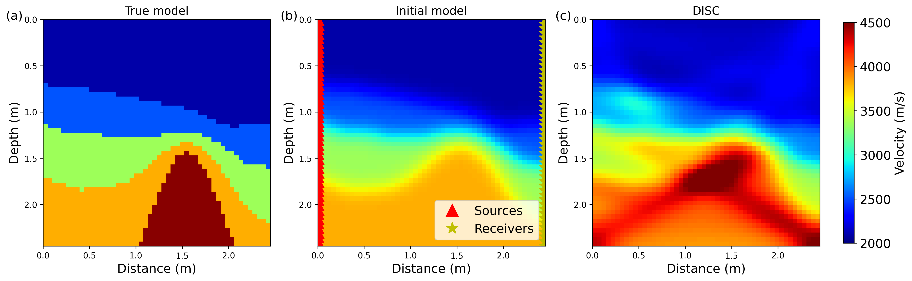
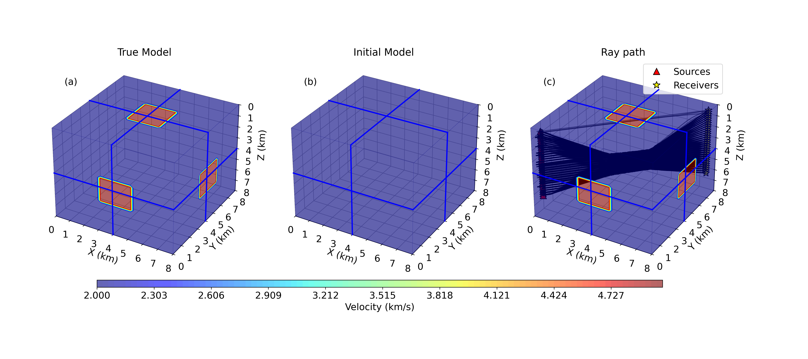

# <div align="center">
# DISCtomo: A Python package for direct smoothness constrained seismic traveltime tomography and uncertainty analysis
**Chao Li**<sup>1</sup> &nbsp;&nbsp;
**Yangkang Chen**<sup>1</sup>

<sup>1</sup> Bureau of Economic Geology, John A. and Katherine G. Jackson School of Geosciences, The University of Texas at Austin  


</div>

---

## Abstract
First-arrival traveltime tomography is essential for reconstructing subsurface velocity structures from seismic data. We propose a new iterative inversion method that introduces a DIrect Smoothness Constraint (DISC) into a conjugate gradient framework. Unlike conventional approaches using indirect smoothness constraints such as Tikhonov regularization, the DISC enforces smoothness directly on model updates, accelerating the convergence, and enhancing the inversion stability. We compute the ray path matrix efficiently from a traveltime table generated by a fast-marching eikonal solver, avoiding explicit ray tracing and ensuring robustness in complex velocity fields. The inversion scheme leads to improved computational efficiency and model fidelity. Applications to several 2D and 3D synthetic and field datasets demonstrate that DISC-based tomography yields more robust inversion results and more geologically consistent velocity models than standard Tikhonov-regularized inversions. The proposed method provides a stable and efficient framework for robust seismic velocity imaging in both exploration and crustal studies.

---

## Framework

<p align="center">
  
</p>

<p align="center">
  <b>Figure 1.</b> A sketch of DISC for ray tracing from receiver position to source position. 
</p>

The workflow of DISC consists of the following main steps:

1. Conduct ray tracing based on a traveltime table estimated by Eikonal equation.
2. Construct ray path matrix based on he initial model
3. Compute the misfit between synthetic data and observed data.
4. Estimate the model update using CG iteration with shaping regularization and update the current model
5. Repeat steps 1-4 until convergence.

---

## Documents demonstration

- The data folder contains necessary models and dataset used to reproduce the numerical results.
- The Notebook folder contains necessary code to reproduce the tomography experiments, including checkerboard, saltbody, 3D anormal and ASVGD DISC for uncertain evaluation.
- The disc folder constains all the necessary functions for DISC package.
- DISC depends on the following external packages: 1. [Pyekfmm](https://github.com/aaspip/pyekfmm) 2. [Pyseistr](https://github.com/aaspip/pyseistr)

---
## Result

<p align="center">
  
</p>

<p align="center">
  <b>Figure 2.</b> (a) Real velocity model, (b) Ray tracing using DISC method, (c) Observed traveltime calculated using Eikonal equation, (d) Estimated traveltime by DISC method, and (e) The traveltime difference bewteen Figures 2(c) and 2(d). 
</p>

<p align="center">
  
</p>

<p align="center">
  <b>Figure 3.</b> (a) Real checkerboard velocity model, (b) Initial constant velocity model, and (c) Inverted velocity model using DISC method.
</p>

<p align="center">
  
</p>

<p align="center">
  <b>Figure 4.</b> (a) Real saltbody model, (b) Initial saltbody model, and (c) Inversion result of DISC.
</p>

<p align="center">
  
</p>

<p align="center">
  <b>Figure 5.</b> (a) Real 3D velocity model, (b) Initial model used for DISC inversion, and (c) Ray paths estimated by DISC method.
</p>

<p align="center">
  
</p>

<p align="center">
  <b>Figure 6.</b> (a) Real 3D velocity model (ground truth) and (b) Inverted 3D result using DISC method. 
</p>

<p align="center">
  
</p>

<p align="center">
  <b>Figure 7.</b> Generated initial particles used for ASVGD DISC inverison. The geometry is same as that shown in Figure 3.
</p>


<p align="center">
  
</p>

<p align="center">
  <b>Figure 8.</b> (a) Real checkerboard model, (b) Estimated Vp mean value distribution using ASVGD DISC, and (c) Estimated Vp std map (uncertainty distribution). Higher std value means more uncertainties.
</p>


---


## Installation

To set up the environment, run:

```bash
conda env create -f environment.yml
conda activate your_env_name
```

---

## Reference 

> Li and Chen, 2026, Seismic Traveltime Tomography Using Direct Smoothness-Constrained Iterative Inversion, IEEE Transactions on Geoscience and Remote Sensing, 64, pp. 5909912.

### BibTex

```bibtex

@ARTICLE{DISC2026,
  author={Li, Chao and Chen, Yangkang},
  journal={IEEE Transactions on Geoscience and Remote Sensing}, 
  title={Seismic Traveltime Tomography Using Direct Smoothness-Constrained Iterative Inversion}, 
  year={2026},
  volume={64},
  number={},
  pages={5909912-5909912},
  doi={10.1109/TGRS.2026.3688440}
}


```


